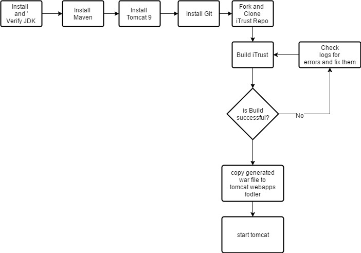

# DevOps Project – Milestone 1 (CM)

This is first milestone for the DevOps project in which we implemented automation for the configuration management.

We implemented this for two projects wiz Checkbox.io(NodeJS project) and ITrust(Java project). We used tools like vagrant for setting up virtual machine for deploying these applications. We also used ansible tool for configuration of VM.

We faced several issues during the entire process. Herewith we are writing the detailed report about the entire process.

## A] iTrust:

- iTrust is a java application used in the undergrad software engineering system. It uses tomcat, mysql, java, and maven. It has a rich set of unit tests.
- Following is the configuration management process for the iTrust

Following were the steps followed while setting up iTrust manually on virtual machine:

1. 1)JDK Installation:
  1. sudo add-apt-repository ppa:webupd8team/java
  2. sudo apt-get update
  3. sudo apt-get install oracle-java8-installer
2. 2)Maven Installation:
  1. sudo apt-get update
  2. sudo apt-get install maven
3. 3)MySQL server installation:
  1. sudo apt-get update
  2. sudo apt-get install mysql-server
4. 4)Tomcat installation:
  1. wget http://www.us.apache.org/dist/tomcat/tomcat-9/v9.0.0.M1/bin/apache-tomcat-9.0.0.M1.tar.gz (Please refer tohttp://tomcat.apache.org/download-90.cgi for the exact URL )
  2. tar xzf apache-tomcat-9.0.0.M1.tar.gz
  3. mv apache-tomcat-9.0.0.M1 tomcat9
5. 5)Maven Build:
  1. Use &quot;mvn clean test package&quot;. This will perform following tasks:
    1. Clean the target directory of iTrust.
    2. Compile java files in iTrust.
    3. Executing Junit test cases for iTrust.
    4. Package binary files into a WAR file.
6. 6)Deploy War file and Start Tomcat:
  1. Copy war file into webapps directory of tomcat.
  2. Start tomcat using /usr/local/tomcat9/bin/startup.sh

We came across following issues during the process:

1. a)Vagrant allocates some initial memory to the VM created. When we tried to build the iTrust project, the build process was getting terminated abruptly. After analyzing this issue we concluded that this was because the memory assigned by vagrant was not sufficient. Quick solution to this problem was allocating memory manually for the VM in to .vagrant file. This solved our problem.
2. b)Problems while executing database scripts. Table name in database scripts is case sensitive when run in linux environment. This was the showstopper for us since we were not able to understand the reason why scripts are not running. However minor modifications to my.conf solved the problem.

## B] checkbox.io:

To setup and successfully run the checkbox.io on the system, we need to install following dependencies first.

- install nginx

- install node and nom

- install mongodb

Once above dependencies are installed on the machine,

- git clone checkbox.io repo

Now, next step is to install package dependencies required to run the checkbox.io.

For that, we can run command npm install to download all dependencies mentioned in package.json.

The given list of dependencies is incomplete and therefore need to add remaining dependencies in the package.json.

- We added following dependencies in package.json

    &quot;json5&quot;: &quot;0.5.1&quot;,

    &quot;jade&quot;: &quot;1.11.0&quot;,

    &quot;underscore&quot;: &quot;1.8.3&quot;,

    &quot;mongodb&quot;: &quot;2.2.22&quot;,

    &quot;emailjs&quot;: &quot;1.0.8&quot;,

    &quot;validator&quot;: &quot;6.2.1&quot;,

    &quot;async&quot;: &quot;2.1.4&quot;

and also changed version of marked to &quot;marked&quot;: &quot;0.3.6&quot; .

After then, npm install worked fine.

- Now we start the mongo services and then need to start the server using command node server.js.  But this, server.js had problems in code, that we needed to correct it.

- In admin.js file, for line

var Server = mongo.Server,

           Db = mongo.Db,

           ObjectID = mongo.BSONPure.ObjectID;

in above code, it failed to get BSONPure.ObjectID. We corrected it by modifying it to,

ObjectID = mongo.ObjectID;

Similar changes were done to live.js, study.js and upload.js file.

After all the above changes, checkbox.io is ready to run. But to render it successfully we need to update nginx.conf file. We copy the given nginx.conf file and default file and put it into in place of the present nginx.conf file on system at path - /usr/local/etc/nginx and default file at path - /usr/local/etc/nginx/sites-available

This change will make the nginx to listen on port 80.

Now, in default file we changed the root to path of public\_html folder present in the checkbox.io directory as,

root /Users/myname/Documents/checkbox.io/public\_html/;

This will make the nginx to load the content from public\_html folder at above path.

**Credentials from Environment variables:**

For mongodb authentication and email server username/password, we modified admins.js, create.js files to retrieve these credential values from bash.rc file using environment variables.

Now, if we start nginx service and run command node server.js, we can check on the url http://localhost:80, the homepage of checkbox.io perfectly rendered.

**Automation with Ansible**

We created a ansible playbook to automate the configuration of checkbox.io and successfully run it on browser.

**Issues faced during automation:**

- Major issue we faced was the setting up the authentication of mongoldb. Normally, mongodb use does not ask for the security authentication. But we wanted to enabled it and we will provide the credentials on host machine&#39;s bash.rc file.

     - For this, we first changed the code for admin.js file to retrieve the credentials from bash.rc file using environment variables.

     - From ansible script, we added username and password to bash.rc fil using attribute blockinfile.

     - From ansible script, we modified mongod.conf file and enabled authorization.

- Other issue happened was, script was not able to finish its execution after we started the nodejs service and it ran forever. To fix this, we used the forever dependency.

      - First installed the forever using npm.

      - Get the list of running services and stored it in a variable

      - Checked for server.js service from the list variable and then start it using forever start command.

- While automating the authentication, environment variables needed to be set throughout the time mongodb runs. While doing manually, we can generally provide sourcing these variables in script or we can it in shell script.

      - In ansible script, we used the enviornment directive to set up the variables all time during the services run.
